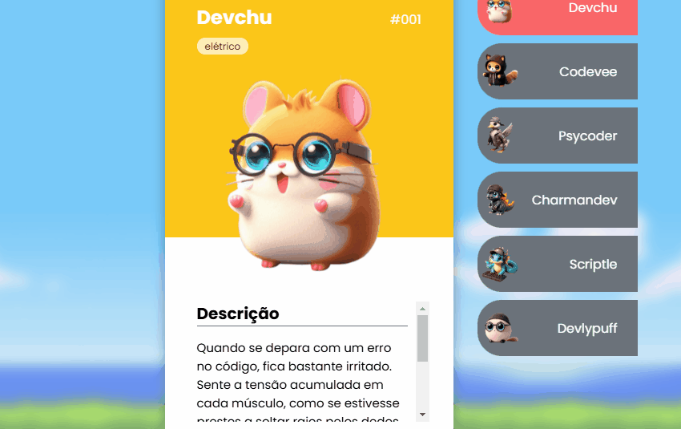

# Projeto com README
Um projeto de teste com um arquivo README 👌

[]

## Tecnologia utilizada
- HTML
- CSS
- JS

## como utlilizar

1- Clone para o projeto
```

git clone <url>
```

2- Acesse a pasta do projeto
```

Cd repositorio_com_readme
```